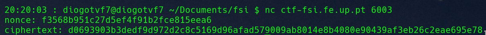
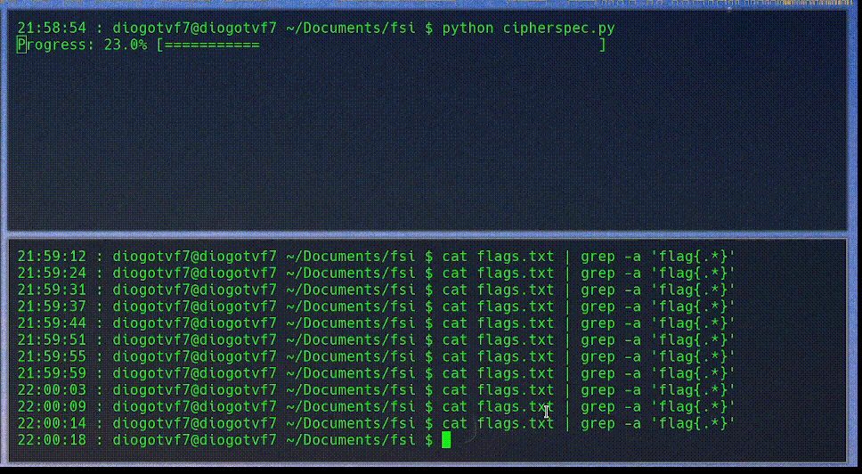

# CTF Semana #10 (Weak Encryption)

## Introdução

Como contexto para este CTF foi-nos apresentado um ficheiro com três funções: `enc`, `dec`, `gen`.

```python
def gen():
def enc(key, message, nonce):
def dec(key, ciphertext, nonce):
```

As funções `enc` e `dec` encriptam e desencpritam uma mensagem, respetivamente, usando o algoritmo AES-CTR.
A função `gen` gera uma chave. Nesta função foi usado um "truque" que acelera a encriptação das mensagens, no entanto, este truque introduz uma vulnerabilidade.

```python
def gen():
	offset = 3 # Hotfix to make Crypto blazing fast!!
	key = bytearray(b'\x00'*(KEYLEN-offset))
	key.extend(os.urandom(offset))
	return bytes(key)
```

É-nos também dada uma porta para o servidor que nos dá acesso à mensagem cifrada e ao nonce usado.

<center>
    
</center>

### AES-CTR

Um dos vários modos de encriptação do AES (Advanced Encryption Standard) é o CTR (Counter). Este é um modo de encriptação por blocos que encripta cada bloco de forma independente dos outros. Este modo usa um contador que é inicializado com o valor do nonce - ou IV (Initialization Vector) - e é incrementado a cada bloco. Este contador é combinado com a chave de modo a gerar um output ao qual será aplicado um XOR com o bloco de texto correspondente. O resultado será o bloco encriptado. Todos os blocos juntos formarão a mensagem encriptada.

<center>
    
</center>

### Vulnerabilidade

A função `gen()` gera chaves cujos primeiros `KEYLEN - 3` bytes são iguais a 0, apenas os 3 últimos são gerados aleatóriamente. Isto cria uma grande vulnerabilidade uma vez que faz com que a quantidade de chaves diferentes que podem existir seja reduzida a 256³ (tamanho de um byte multiplicado pela quantidade de bytes gerados aleatóriamente). Este número, embora grande, cria a possibilidade de um ataque por _brute force_.

## Ataque

### 1. Gerar chaves

Fizemos um pequeno script que gera chaves e que as usa na função `dec()` gerando assim uma possível mensagem desencriptada que é escrita para um ficheiro `flags.txt`.

```python
nonce = unhexlify('cc24780078b683fde898ef9963d223e0')
ciphertext = unhexlify('d0da2d6d640981d6573237aa4aff12cbf8d19e00488390cc1ef3395a0d2e81842f3bc2dace7ace')
flags = open("flags.txt", "a")
total_iterations = 16777215
for i in range(total_iterations):
	if (i + 1) % (total_iterations // 100) == 0:
		percent_completed = (i + 1) / total_iterations * 100
		status_bar = int(percent_completed / 2) * "="
		print(f"Progress: {percent_completed:.1f}% [{status_bar:50s}]", end="\r", flush=True)
	flags.write(dec(b'\x00'*(KEYLEN-3) + i.to_bytes(3, 'big'), ciphertext, nonce).decode('latin-1'))
	flags.write('\n')
flags.close()
```

### 2. Analisar resultados

À medida que o script vai gerando as chaves podemos ir correndo o seguinte comando para verificar se alguma das mensagens desencriptadas é a flag - isto apenas é possível uma vez que sabemos que a chave assume o formato `flag{...}`.

```bash
$ cat flags.txt | grep -a flag{.*}
```


