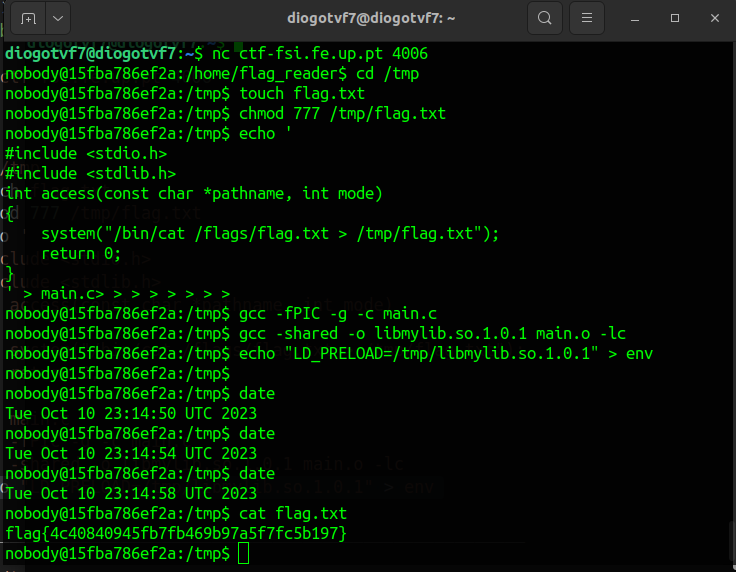

# CTF Semana #4 (Linux Environment)

## Introdução

Para realizar este CTF é-nos dado um servidor ao qual nos devemos conectar através do comando netcat: `nc ctf-fsi.fe.up.pt 4006`.
A organização dos ficheiros necessários para a resolução do CTF é a seguinte:

```
|  -  etc
|      |  -  cron.d
|      |       |  -  my_cron_script
|  -  tmp
|      |
|  -  home
|      |  -  flag_reader
|      |       |  -  admin_note.txt
|      |       |  -  env
|      |       |  -  last_log
|      |       |  -  main.c
|      |       |  -  my_script.sh
|      |       |  -  reader
|  -  flags
|      |  -  flag.txt
```

## Pistas

No moodle, é-nos apresentada a seguinte tarefa:

> Podes encontrar bastantes dicas na home folder do servidor. Explora atentamente os ficheiros disponíveis e as suas permissões. Em particular, encontrarás código de um script que corre regularmente no servidor. O administrator teve bastante cuidado em impedir que esse script releve informação inadvertidamente. A tua tarefa é subverter esse script para obter a flag escondida.

Para além disso, no diretório /home/flag_reader, através do comando `cat` é possível ler o ficheiro `admin_note.txt`:

> flag_reader, <br>
> I locked you out of the temp folders.
> Told you before they are not to be used as permanent storage!
> Hackers stole the flag by reading the files you left there!!!!!!
> Finish your damn program ASAP!!!!!
> Tired of waiting for you to lock them out for good, you lazy !@%# <br> > \- The Admin

## Abordagem

### Pista 1

A referência a um script que corre regularmente no servidor deixou-nos curiosos, levando-nos a pesquisar sobre este assunto. Rapidamente chegamos ao programa `cron`, neste caso, que era responsável por fazer o **job-schedulling** deste servidor.
Rapidamente conseguimos encontrar o ficheiro `/etc/cron.d/my_cron_script`. Este ficheiro continha o seguinte conteúdo:

```bash
* * * * * flag_reader /bin/bash -c "/home/flag_reader/my_script.sh > /home/flag_reader/last_log"
```

Este script é executado a cada minuto com o perfil do utilizador `flag_reader`. O script executa o script `my_script.sh` e redireciona o output para o ficheiro `last_log`.

### Pista 2

Ao falar sobre os **"temp folders"** (`/tmp`) no ficheiro `admin_note.txt`, fomos explorar esta pasta. Rapidamente concluímos que esta era a única pasta onde o nosso utilizador (`nobody`) tinha permissões para escrever.

### /home/flag_reader

Neste diretório encontramos o ponto chave do exploit que precisamos de executar. Os ficheiro `main.c` e `my_script.sh` contém os seguinte códigos:

<table>
<tr>
<td>

```c
#include <stdio.h>
#include <unistd.h>

void my_big_congrats(){
    puts("TODO - Implement this in the near future!");
}

int main() {
    puts("I'm going to check if the flag exists!");

    if (access("/flags/flag.txt", F_OK) == 0) {
        puts("File exists!!");
        my_big_congrats();
    } else {
        puts("File doesn't exist!");
    }

    return 0;
}
```

</td>
<td>

```bash
#!/bin/bash

if [ -f "/home/flag_reader/env" ]; then
    echo "Sourcing env"
    export $(/usr/bin/cat /home/flag_reader/env | /usr/bin/xargs)
    echo "" > /home/flag_reader/env
fi

printenv
exec /home/flag_reader/reader
```

</td>
</tr>
<tr>
<td>
<center>

`main.c`

</center>
</td>
<td>
<center>

`my_script.sh`

</center>
</td>
</tr>
</table>

Ao corrermos o ficheiro `reader` podemos ver que este é o binário do ficheiro `main.c` compilado. Analisando o script `my_script.sh` (o script corrido pelo cron jobs com as permissões flag_reader) podemos verificar que este nos permite seguir por dois exploits diferentes:

1. O primeiro exploit baseia-se no criação de um ficheiro binário chamado `printenv` e a mudança da variável de ambiente `PATH` para /tmp de modo a que o script `my_script.sh` execute o nosso ficheiro em vez da função printenv situada em **/bin/printenv**.
2. O segundo exploit baseia-se na criação de uma biblioteca partilhada que contenha uma implementação da função `access`. Devermos _linkar_ o nosso programa à biblioteca de **C** de modo a, alterando a variável de ambiente `LD_PRELOAD` darmos prioridade a esta nossa biblioteca em vez da biblioteca de **C**.

Dentro do programa **C** que criarmos (seja seguido qualquer um dos exploits) poderemos passar os conteúdos do ficheiro `/flags/flag.txt` para um outro ficheiro de texto uma vez que este programa será executado com as permissões **flag_reader**. O ficheiro para o qual passamos o conteúdo deverá ser criado anteriormente na pasta `/tmp` e as suas permissões deverão ser alteradas de modo a permitirem que o utilizador **flag_reader** possa escrever no mesmo.

## Exploits

### Exploit 1 - access



### Exploit 2 - printenv


## Como defender um sistema estes ataques

### Exploit 1 - access

Uma maneira de nos defendermos deste ataque seria compilando o ficheiro `main.c` estáticamente - em vez de dinâmicamente, como é feito - uma vez que, ao compilar um ficheiro estáticamente todo o código necessário para a sua execução é incluído fisicamente no seu binário. Deste modo, mesmo que a variável de ambiente `LD_PRELOAD` seja alterada, o programa irá sempre executar a função `access` do sistema.

### Exploit 2 - printenv

De maneira a defender o servidor deste ataque, no script `my_script.sh` deveria ser antes adicionado o seguinte código:

```bash
#!/bin/bash

if [ -f "/home/flag_reader/env" ]; then
    echo "Sourcing env"
    export $(/usr/bin/cat /home/flag_reader/env | /usr/bin/xargs)
    echo "" > /home/flag_reader/env
fi

/bin/printenv
exec /home/flag_reader/reader
```

Agora que a função `printenv` é chamada com o seu caminho absoluto, ainda que a variável de ambiente `PATH` seja alterada, o script `my_script.sh` irá sempre executar a função `printenv` do sistema.
