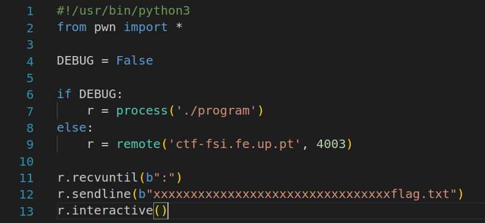
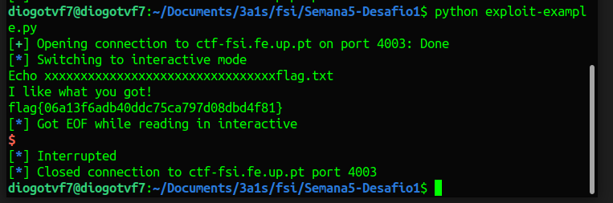
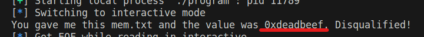
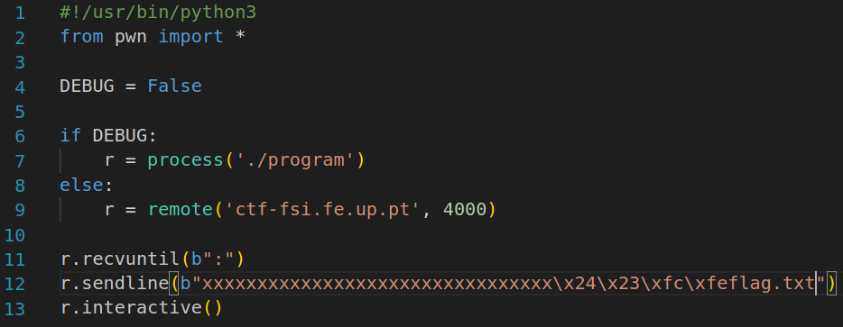
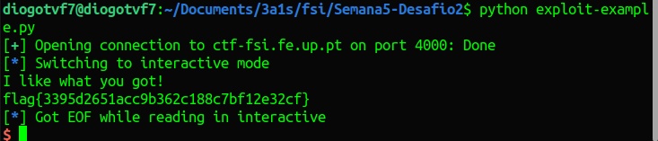

# CTF Semana #4 (Linux Environment)

## Desafio 1

> Para o primeiro desafio, começamos por explorar os ficheiros fornecidos pela plataforma CTF como nos foi indicado. Estes são os ficheiros que estão a ser executados no servidor na porta indicada (4003).
>
> Inicialmente, corremos `checksec program` e analisamos algumas informações relevantes acerca do programa, tal como a arquitetura (x86, Arch), a inexistência de canários, a não-randomização das posições do binário, entre outras (todas foram mencionadas no enunciado do moodle).
>
> Ao observar o funcionamento do código main.c, verificámos que foram alocados 8 bytes para o `meme_file` e 32 para o `buffer`.
>
> ```c
> char meme_file[8] = "mem.txt\0";
> char buffer[32];
> ```
>
> Também soubemos que a função `scanf()` é vulnerável a _buffer overflow_, pois não limita o número de caracteres que podem ser lidos para o `buffer` de acordo com o tamanho dele, mas sim de acordo com o valor passado como argumento em `%40s`.
>
> ```c
> scanf("%40s", &buffer);
> ```
>
> Na memória da stack, o `meme_file` e o `buffer` foram alocados contiguamente pela ordem de declaração no ficheiro (recordar a não-randomização). Assim, bastou exceder a capacidade do buffer para conserguimos aceder à memória reservada ao `meme_file` e reescrever o nome. O objetivo foi alterá-lo para `flag.txt` e assim conseguimos ler o seu conteúdo devido às intruções do `main.c`
>
> No programa python, alterámos então a seguinte linha de código de modo a que atingíssemos a zona de memória do `meme_file`, digitando qualquer caractér para os primeiros 32 bytes:
>
> 
>
> Em resposta da execução, lemos o conteúdo do ficheiro `flag.txt` e obtivemos a primeira flag:
>
> 

## Desafio 2

> Este desafio foi semelhante ao primeiro. Notámos que, para além do `meme_file` e do `buffer`, também foi alocado espaço para o `val`.
>
> ```c
> char meme_file[9] = "mem.txt\0\0";
> char val[4] = "\xef\xbe\xad\xde";
> char buffer[32];
> ```
>
> Também verificámos a condição no ficheiro `main.c` que verificava o valor de `val`. Neste desafio, o conteúdo do ficheiro `flag.txt` só seria lido se o valor de `val` correspondesse a ao valor dessa condição (`if(*(int*)val == 0xfefc2324)`).
>
> Começámos por colocar o valor de `val` igual ao da condição, contudo obtivemos a seguinte pista:
>
> 
>
> Entendemos então que os bytes de `val` deveriam ser escritos ao contrário, pois a arquitetura é little-endian (`Arch: i386-32-little`).
>
> 
>
> Assim, alterámos o valor de `val` de `\xef\xbe\xad\xde` para `\x24\x23\xfc\xfe` e obtivemos a segunda flag:
>
> 
