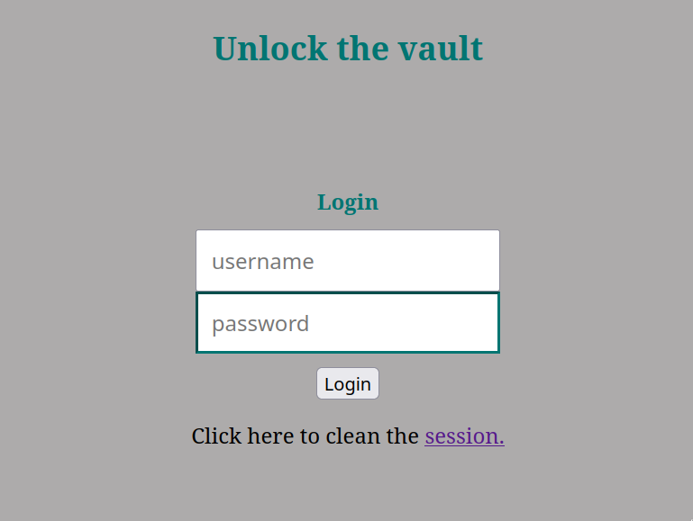
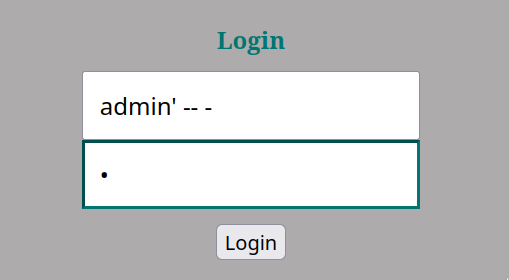
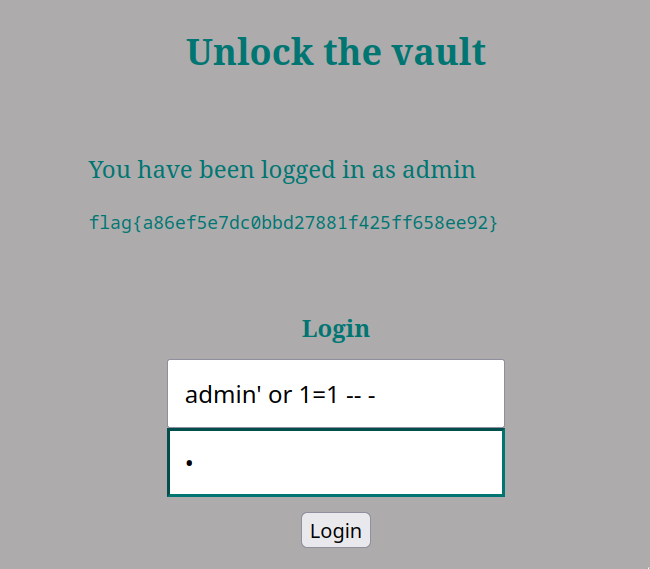

# CTF Semana #8 (SQL Injection)

## Introdução

Para este CTF apenas nos foi dado um ficheiro `index.php` que é o código que corre no servidor que se encontra em `http://ctf-fsi.fe.up.pt:5003/`. Também nos foi dito que a flag se encontra num ficheiro `flag.txt` cujo conteúdo é mostrado a quem se autenticar no servidor.

No servidor podemos encontrar a seguinte página de login:



## Análise

A partir da visualização do código:


podemos analisar que a preparação da query à base de dados não é segura uma vez que não são feitos quaiquer escapes às strings de input do utilizador. Isto facilita todo o processo de _SQL Injection_.

## Resolução

A primeira intuição que tivemos foi tentar dar login com o username `admin`. No entanto, como não sabemos qual a sua palara-passe, devemos tentar comentar o resto da querry de maneira a apenas necessitarmos de fornecer o _username_ do utilizador a que pretendemos aceder. Inserimos por isso o seguinte:



O username que escremos faz com que a query seja a seguinte:

```sql
SELECT * FROM users WHERE username = 'admin' -- - ' AND password = '.'
```

Basicamente inserimos o nome do administrador e fechamos a aspa que contém a string do username. Com isto, o resto do input será interpretado como código SQL. Inserindo dois traços (`--`) após o fecho da aspa estaremos a comentar toda a query que seria feita de seguida, que neste caso é a verificação da palavra-passe. Deste modo podemos facilmente fazer login sem saber a palavra-passe do administrador. Conseguimos, assim, a flag:


