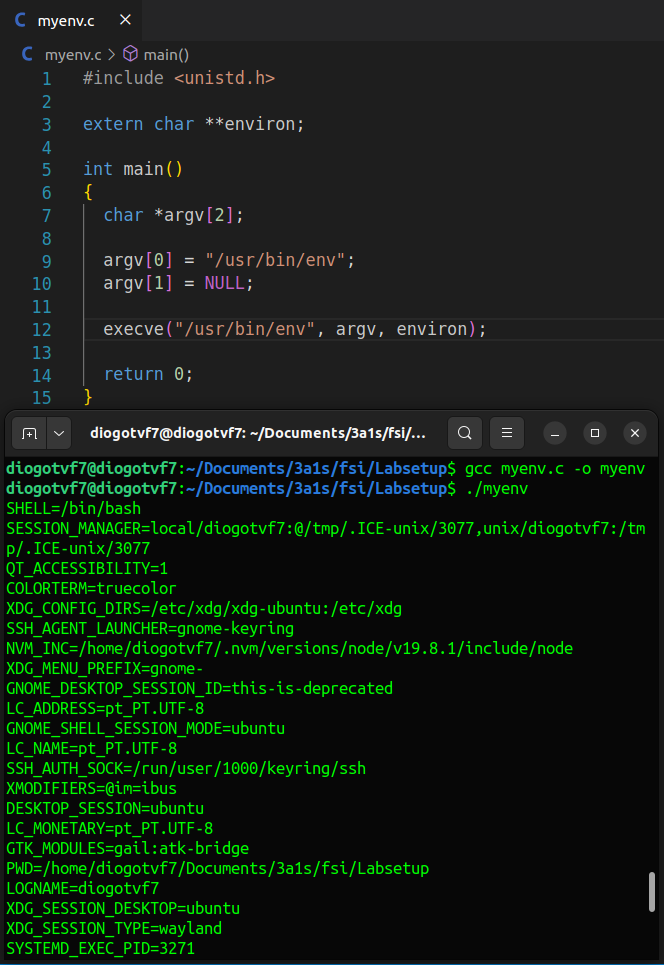
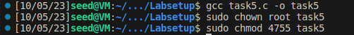
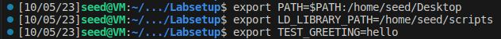
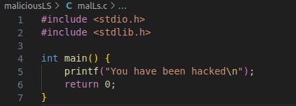
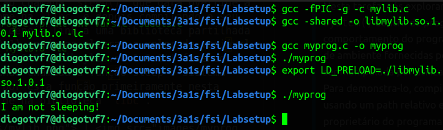
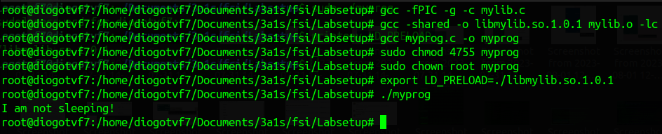
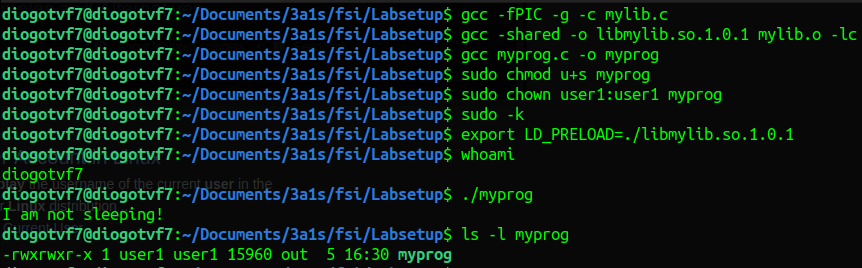

# Semana #4

## Environment Variable and Set-UID Program Lab: Tarefas

### Tarefa 1

> Como indicado no enunciado do lab, o comando `printenv` lista todas as variáveis de ambiente do sistema e o comando `printenv VAR` indica o valor da variável de ambiente VAR. <br>
> Por exemplo para a variavel de ambiente "PWD", temos o seguinte output: <br>
>
> ```bash
> $ printenv PWD # /home/seed
> ```

### Tarefa 2

> Correndo o código fornecido, obtivemos as variáveis de ambiente do processo pai e do processo filho em 2 ficheiros diferentes. A diferença entre os dois deu um resultado vazio, pelo que tirámos a conclusão de que **o filho herda as variáveis de ambiente do pai** depois de executar o `fork()`. Assim, não há diferença no ambiente de execução.
>
> 

### Tarefa 3

> O código fornecido no enunciado possui o terceiro argumento do comando `execve` a NULL e, desta forma, as variáveis de ambiente não são passadas ao programa chamado, originando um output vazio. <br>
> Substituindo NULL pela variável "environ", entendemos que as variaveis de ambiente serão explicitamente passadas do processo atual para o novo programa.
>  > 

### Tarefa 4

> Com o objetivo de confirmar se as variáveis de ambiente tinham sido passadas para o novo programa executado, quisemos comparar os resultados do comando
>
> ```bash
> $ env
> ```
>
> com o output do programa compilado a partir de `mysystem.c` presente no enunciado:
>
>  <br>
> Para tal, corremos os seguintes comandos no terminal e analisamos os ficheiros com os respetivos outputs.
>  <br>
> Desta análise tirámos que as variáveis de ambiente do processo atual foram passadas para o novo programa executado, confirmando assim o comportamento das variáveis de ambiente quando chamamos a função `system()` descrito no enunciado.

### Tarefa 5

> Como foi pedido, criamos um programa "`task5`" que mostra todas as variaveis de ambiente do processo atual, definimos "root" como proprietário do programa e tornamo-lo num programa SET-UID, através dos seguintes comandos:
>  <br>
> Um programa SET-UID assume os privilégios do proprietário do programa. <br>
> Modificamos algumas variáveis de ambiente e criamos uma nova, através do comando `export`.
>
> 
> Depois disso executámos o programa "`task5`" e analisamos o seu output.
> Verificamos que as variavéis de ambiente do processo pai foram passadas para o programa "`task5`" (incluindo a `PATH` e a `TEST_GREETING`): 
> 
>
>  <br>
> Contudo, a variável `LD_LIBRARY_PATH` não constava na lista de variáveis de ambiente do programa. <br>
> Esta variavel permite definir um "path" onde o programa pode procurar por bibliotecas dinâmicas partilhadas e, desta forma, seria possivel executar um programa malicioso através de uma das bibliotecas utilizadas. <br>

### Tarefa 6

> Nesta tarefa, nós exploramos os riscos potenciais de usar a função `system()` dentro de programas Set-UID. Aprendemos que o comportamento do programa shell pode ser influenciado por variaveis de ambiente fornecidas pelo utilizador, por exemplo `PATH`, que pode ser manipulada por utilizadores maliciosos. <br>
> Para demonstra-lo, compilamos o programa "`task6`" para executar `ls` usando um path relativo em vez de um path absoluto. Tornámos "root" o proprietário do programa e tornamo-lo um programa Set-UID, com os comandos indicados na tarefa anterior. Ao alterar a variavel `PATH`:
>
> 
>
> fizemos com que fosse possível executar o nosso próprio código
> 
>
>  <br>
> em vez de `/bin/ls`, mostrando assim a vulnerabilidade a nível de segurança <br>
> Ao executar o programa "`task6`" temos:
>
> 
>
> Esta tarefa destacou a importância de considerar este género de implicações, especialmente ao lidar com funções privilegiadas como system() em programas Set-UID. <br>

### Tarefa 7

> Nesta tarefa exploramos os riscos associados à interação dos programas **Set-UID** com a variável de ambiente **LD_PRELOAD**. As variáveis de ambiente `LD_PRELOAD`, `LD_LIBRARY_PATH`, e outras do formato `LD_*` influenciam o comportamento do loader/linker dinâmico o, neste caso, nos permite dar override a funcções da biblioteca de funções de C.
>
> Criando uma função chamada `sleep()` que dará override à função de mesmo nome na `libc` e depois compilando o seu ficheiro dando-lhe depois link a uma biblioteca partilhada (./libmylib.so.1.0.1), podemos alterar o valor da variável de ambiente **LD_PRELOAD=./libmylib.so.1.0.1** fazendo assim com que, quando chamada a função sleep o sistema operativo procure por esta função primeiramente nesta biblioteca em vez de na biblioteca `libc`.
>
> |  |  |
> | ------------------------------------- | -------------------------------------- |
> | mylib.c                               | myprog.c                               |
>
> Ao correr o programa `myprog` verifica-se que, de facto, a função corrida foi a função sleep() definida por nós em vez da função da libc sleep().
>
> |                    |                     |
> | :-----------------------------------------------------: | :------------------------------------------------------: |
> | Running myprog as a normal program and as a normal user | Running myprog as a Set-UID program and as a normal user |
>
> |                  |                           |
> | :---------------------------------------------------: | :------------------------------------------------------------: |
> | Running myprog as a Set-UID program as a root account | Running myprog as a SET-UID user1 program and as a normal user |
>
> Pode-se verificar que em todas as situações descritas o output do programa `myprog` vai ser o output da função sleep() definida por nós.
