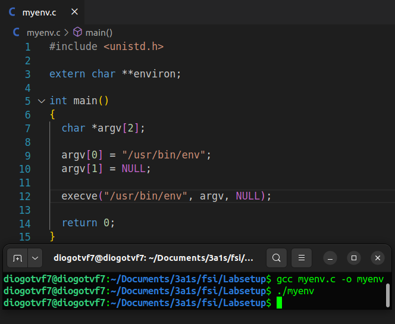
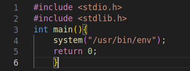
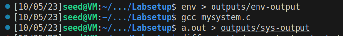

# Semana #4: Environment Variable and Set-UID Program Lab

## Tarefas

### Tarefa 1
> Como indicado no enunciado do lab, o comando `printenv` lista todas as variáveis de ambiente do sistema e o comando `printenv VAR` indica o valor da variável de ambiente VAR. <br>
> Por exemplo para a variavel de ambiente "PWD", temos o seguinte output: <br> 
> ````bash
> $ printenv PWD # /home/seed
> ````

### Tarefa 2
> Correndo o código fornecido, obtivemos as variáveis de ambiente do processo pai e do processo filho em 2 ficheiros diferentes. A diferença entre os dois deu um resultado vazio, pelo que tirámos a conclusão de que **o filho herda as variáveis de ambiente do pai** depois de executar o `fork()`. Assim, não há diferença no ambiente de execução. <br>


### Tarefa 3
> O código fornecido no enunciado possui o terceiro argumento do comando `execve` a NULL e, desta forma, as variáveis de ambiente não são passadas ao programa chamado, originando um output vazio. <br>
> Substituindo NULL pela variável "environ", entendemos que as variaveis de ambiente serão explicitamente passadas do processo atual para o novo programa. <br>



### Tarefa 4 
> Com o objetivo de confirmar se as variáveis de ambiente tinham sido passadas para o novo programa chamado, quisemos comparar os resultados do comando
> ````bash
> $ env
> ```` 
> com o output do programa 'mysystem.c' presente no enunciado: <br>
>  <br>
> Para tal, corremos os seguintes comandos no terminal e analisamos os ficheiros com os respetivos outputs. <br>
>  <br>
> Desta análise tirámos que as variáveis de ambiente do processo atual foram passadas para o novo programa chamado, confirmando assim o comportamento das variáveis de ambiente quando chamamos a função 'system()' descrito no enunciado. <br>

### Tarefa 5

> Como foi pedido, criamos um programa que mostra todas as variaveis de ambiente do processo atual, definimos "root" como proprietário do programa e tornamo-lo num programa SET-UID. Um programa SET-UID assume os privilégios do proprietário do programa. <br>
> Demos "export" das variáveis listadas e o programa foi executado de novo.Verificámos que a variável LD_LIBRARY_PATH não constava na lista de variaveis de ambiente do programa. Esta variavel permite definir um "path" onde o programa pode procurar por bibliotecas dinamicas partilhadas e, desta forma, seria possivel executar um programa malicioso através de uma das bibliotecas utilizadas. <br>


### Tarefa 6
> Nesta tarefa, nós exploramos os riscos potenciais de usar a função `system()` dentro de programas Set-UID. Aprendemos que o comportamento do programa shell pode ser influenciado por variaveis de ambiente fornecidas pelo utilizador, por exemplo "PATH", que pode ser manipulada por utilizadores maliciosos. <br>
> Para demonstra-lo, compilamos o programa Set-UID para executar ´ls´ usando um path relativo em vez de um path absoluto. Tornámos "root" o proprietário do programa e tornamo-lo um programa Set-UID. Ao alterar a variavel "PATH", conseguimos executar o nosso próprio código em vez de `/bin/ls`, mostrando assim a vulnerabilidade a nível de segurança. <br>
> Esta tarefa destacou a importância de considerar este género de implicações, especialmente ao lidar com funções privilegiadas como system() em programas Set-UID. <br>

