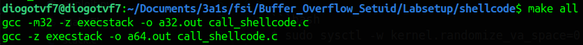
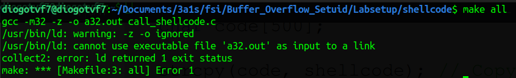
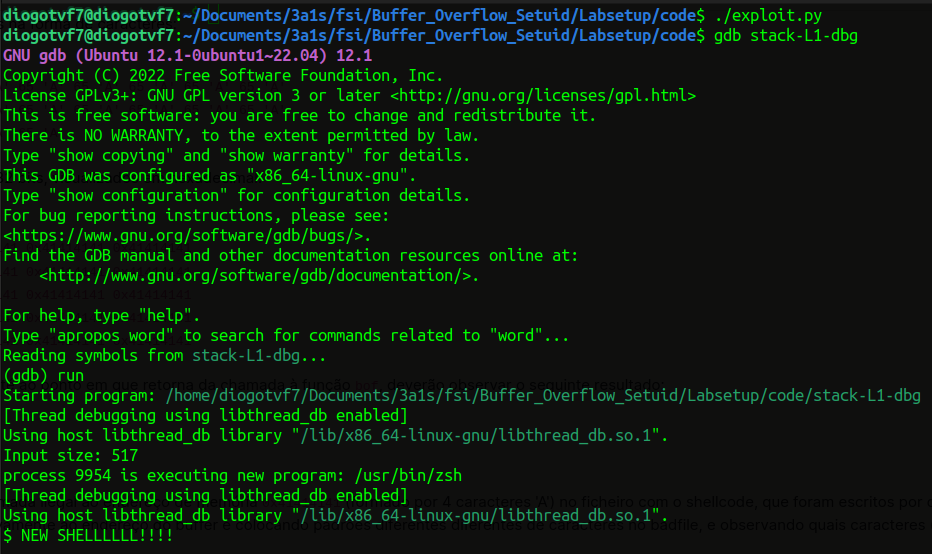
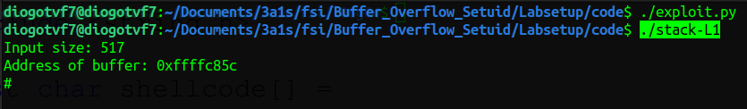

# Semana #5

## Buffer-Overflow Attack Lab: Tarefas

### Tarefa 0

> Como setup, tivemos que desligar algumas proteções do sistema operativo, para que fosse possível realizar as tarefas iniciais.
> Neste caso, desligámos a randomização do espaço de endereços e ligámos o `/bin/sh` ao `/bin/zsh` para podermos executar programas Set-UID sem as limitações impostas por _default_.
> Para tal corremos os seguintes comandos:<br> > **Address Space randomization** ->:
>
> ```bash
> $ sudo sysctl -w kernel.randomize_va_space=0
> ```
>
> **Configuring /bin/sh**:
>
> ```bash
> $ sudo ln -sf /bin/zsh /bin/sh
> ```
>
> Adicionalmente, há mais proteções do sistema operativo (**StackGuard** e **Non-Executable Stack**) que serão desativadas durante a compilação.

### Tarefa 1

> Compilámos o ficheiro call_shellcode.c e gerou ficheiros binários: `a64.out` e `a32.out.` <br> > 
> Corremos ambos e o resultado foi semelhante - Abrimos uma shell no diretório onde o programa foi executado.

> //TODO -> N FUNCIONA C O EXECSTACK
> 

> 

> 

### Tarefa 2

> No código fornecido, verificamos a presença da vulnerabilidade referida, **buffer overflow**. Tal aconteceu porque se tentou copiar um array de caracteres com possibilidade de ter até 517 bytes (`char str[517]`)para um buffer de tamanho máximo de 100 bytes (`char buffer[BUF_SIZE]`). O `strcpy` não verifica os limites do tamanho do buffer e, assim, ocorrerá overflow.
> De seguida, foi pedido que desativassemos o StackGuard e o Non-Executable Stack. Para tal, compilámos o código com as flags `-fno-stack-protector` e `-z execstack` respetivamente. Apos compilar, alteramos o _ownership_ do programa para root e alteramos as permissões para 4755 para que o programa seja Set-UID.

### Tarefa 3

> Nesta tarefa, criamos o ficheiro `badfile` inicialmente vazio. De seguida, corremos o código em modo debug e descobrimos o endereço de retorno da função `bof()` relativamente ao início do buffer, apos colocar um breakpoint na função `bof()` usando o debugger (`gdb`). Também obtivemos o valor do endereço do início do buffer.
> 
> Com os dois endereços obtidos, colocamos na variavel `shellcode` o _shellcode 32-bits_. Criamos com array de bytes com o _length_ máximo lido pelo ficheiro do porgrama `stack.c` (517), com todos os bytes inicializados como `NOP` (`0x90`).
>
> ```python
> # Fill the content with NOP's
> content = bytearray(0x90 for i in range(517))
> ```
>
> Alteramos a variavel start com o valor `517-len(shellcode)` e colocamos a `shellcode` no final do array content(desde `start` até `start+len(shellcode)`).
> O novo endereço de retorno também foi calculado com base no endereço do ebp (frame pointer) e no valor registado em `start`, de modo a que este fique a apontar para o início do _shellcode_.
>
> ```python
> // TODO: ret = METER AS CONTAS DO ENDEREÇO DO RETURN
> ```
>
> Por fim, o `offset` obteve-se a partir da diferença entre o endereço de retorno e o endereço do início do buffer.
>
> ```python
> // TODO: offset = METER AS CONTAS DO OFFSET
> ```
>
> Este offset permite-no saber qual é o endereço do retorno, para o conseguirmo substituir pelo novo endereço de retorno calculado anteriormente, que apontará para o _shellcode_.
>
> ```python
> L = 4  # Use 4 for 32-bit address and 8 for 64-bit address
> content[offset : offset + L] = (ret).to_bytes(L, byteorder="little")
> ```
>
> Por fim, escrevemos o conteúdo do array `content` no ficheiro `badfile`.


Isto e a root shell


### Task 4

> Apesar de os addresses serem diferentes, a diferença entre eles será sempre a mesma, por isso podemos usar o offset calculado na task 3.

```

```
