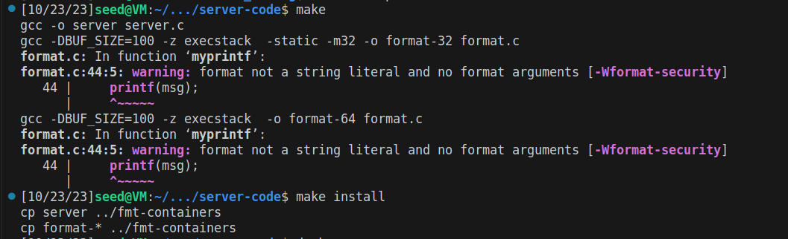
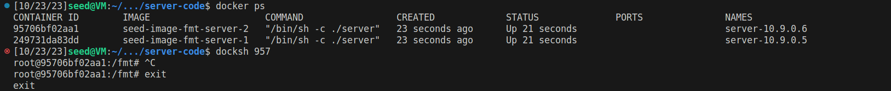
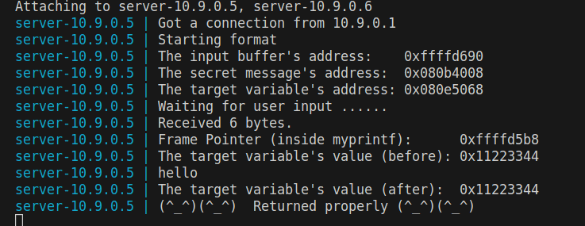
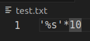
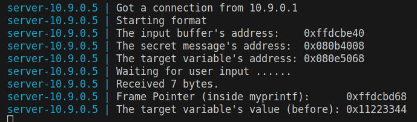
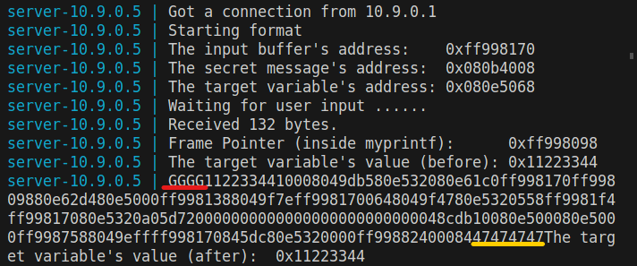

# Semana #6

## Format-String

### Tarefa 0
Antes de comecar o desenvolvimento deste laboratório desligamos a randomização de endereços com o seguinte comando, para que fosse possível descobrir a localização dos endereços do programa:

```bash
$ sudo sysctl -w kernel.randomize_va_space=0
```

Compilamos o código e fizemos a instalação como indicados, aparecendo o seguinte warning:



Depois, corremos o comando `docker-compose up` para iniciar os containers e, de seguida, os comandos `docker ps` e `docksh <id>` 



iniciando assim uma shell nesse container. 


# Tarefa 1

Inicialmente, corremos `$ echo hello | nc 10.9.0.5 9090`, enviando uma mensagem benigna para os servidor e foram impressas as mensagens esperadas no terminal. 



De seguida, o objetivo era fornecer um dado input ao servidor, de tal forma que o programa crashasse ao tentar imprimi-lo na função `myprintf()`. Desta forma, guardamos num ficheiro test.txt o seguinte conteúdo: 

<br>

E corremos:

```bash
$ cat test.txt | nc 10.9.0.5 9090
```

Como não observamos a mensagem `Returned properly`, concluímos que o programa crashou. Mas é de notar, como dito no enunciado, que o programa do **servidor** não crashou - na verdade crashou o programa **`format`** que corre num processo filho gerado pelo processo do servidor.

<br>

Apenas fornecemos `'%s'*10` para que o programa tentasse ler endereços de memória inválidos e crashasse, tal como esperado. 


### Tarefa 2

#### A)
Foram necessários 64 `%x` para conseguirmos visualizar o conteúdo que demos como input na stack, em hexadecimal. O conteúdo do ficheiro `task2a.txt`foi:

```GGGG%x%x%x%x%x%x%x%x%x%x%x%x%x%x%x%x%x%x%x%x%x%x%x%x%x%x%x%x%x%x%x%x%x%x%x%x%x%x%x%x%x%x%x%x%x%x%x%x%x%x%x%x%x%x%x%x%x%x%x%x%x%x%x%x```

Sabemos que `GGGG` corresponde a `47474747` em hexadecimal.
Corremos o seguinte comando:
```bash
$ cat task2a.txt | nc 10.9.0.5 9090
```
E pudemos verificar no output do servidor que o conteúdo do ficheiro foi impresso na stack, como esperado.

<br>

#### B)


### Tarefa 3


%d 32 bits ler como um inteiro
%x hexadecimal