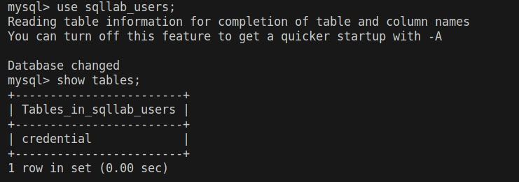
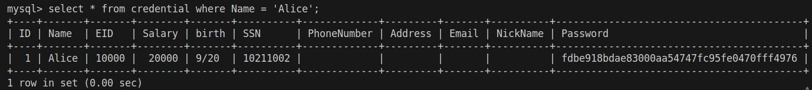
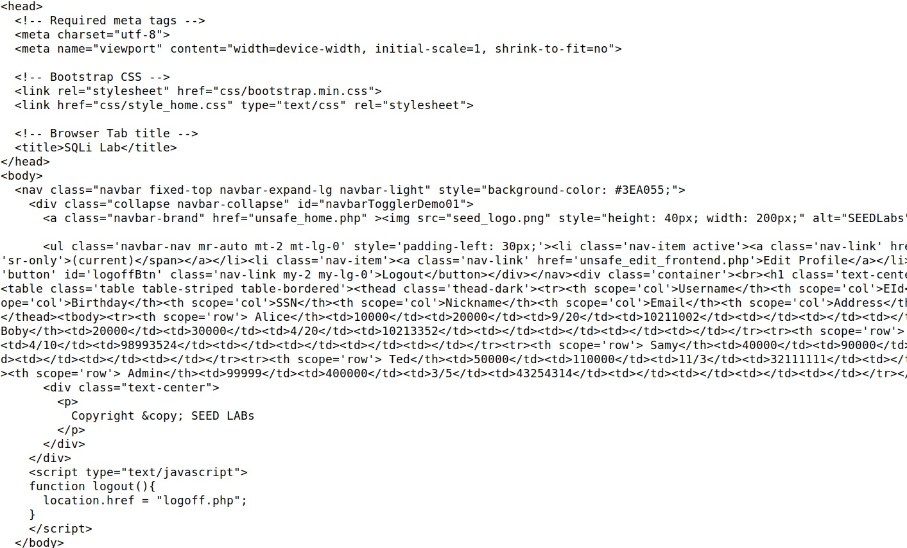

# Semana #8 - TO FINISH!

## SQL Injection

### Tarefa 0

Como setup, tivemos que adicionar uma entrada nos hosts da máquina virtual, executar os *containers* do lab para aceder diretamente à base de dados dos exercícios, abrimos uma shell.
<br>

### Tarefa 1

A sintaxe de SQL já nos é familiar, por isso esta tarefa mostrou ser bastante simples. Após visualizar as tabelas da base de dados:
<br>

Tivemos que selecionar todos os dados do utilizador "Alice" e para isso corremos:
   
```sql
SELECT * FROM credentials WHERE Name = 'Alice';
```

O resultado foi:

<br>


### Tarefa 2.1

Para aceder à conta do Admin, demos como *input* de *username*:

<br>

Desta forma, com `AND 1=1`, a operação será sempre verdadeira e com `-- ` comentaremos o resto da query, inclusive o campo da *password* impedindo que esta seja verificada. O ultimo espaço ` ` é necessário para o *parser* do MySQL não dar erro de sintaxe.


### Tarefa 2.2

<br>

### Tarefa 2.3

